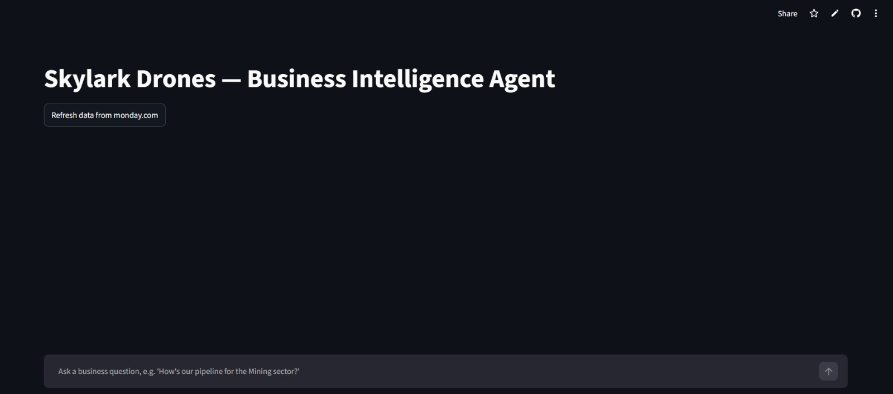

<div align="center">

╔═══════════════════════════════════════════════╗<br>
║&nbsp;&nbsp;&nbsp;&nbsp;S K Y L A R K &nbsp;&nbsp; B I &nbsp;&nbsp; A G E N T&nbsp;&nbsp;&nbsp;&nbsp;║<br>
╚═══════════════════════════════════════════════╝

**FIELD BRIEFING · READ-ONLY DEPLOYMENT · STATUS: OPERATIONAL**

</div>

<br>

| | |
|---|---|
| **SUBJECT** | A conversational analyst wired directly into two live monday.com boards |
| **MISSION** | Turn founder-level questions into founder-ready answers, on demand |
| **DATA SOURCE** | monday.com — Deals & Work Orders, queried fresh, never cached to disk |
| **REASONING ENGINE** | Groq · Llama 3.3 70B, tool-calling |
| **INTERFACE** | Streamlit, single page, dark |
| **CLEARANCE** | Read-only. It cannot, and will not, write back to your boards |

<br>

<div align="center">


`FIG. 1 — the interface, mid-deployment`
</div>

<br>

---

## ▍SITUATION

Your business data lives in monday.com. Your questions don't come in
board-shaped chunks — they come in sentences. *"How's Mining looking?"
"What's stuck?" "Give me something I can paste into the board update."*

Somebody has to sit between those two things: translate the sentence,
pull the right rows, notice what's missing, and hand back something
useful instead of a spreadsheet. That's the whole job here.

---

## ▍CAPABILITIES

The agent is deliberately kept to **three instruments** — no more
surface area than it needs:

```
┌─ query_deals ───────────────────────────────────────┐
│  filters: sector · stage · status                    │
│  returns: row count · pipeline value · sample rows   │
└───────────────────────────────────────────────────────┘

┌─ query_work_orders ─────────────────────────────────┐
│  filters: sector                                      │
│  returns: execution-status breakdown, count & %       │
└───────────────────────────────────────────────────────┘

┌─ get_data_quality_report ───────────────────────────┐
│  filters: none                                        │
│  returns: what's missing, and how much                │
└───────────────────────────────────────────────────────┘
```

Every answer is required — by standing order in the system prompt —
to carry a headline number, the breakdown behind it, relevant
context, any caveat the data demands, and one concrete takeaway.
A bare figure with no interpretation is treated as an incomplete
answer. An ambiguous question ("this quarter" — which year?) gets
a clarifying question fired back before anything is computed.

---

## ▍ARCHITECTURE ON FILE

| Component | Location | Function |
|---|---|---|
| **Command interface** | `app.py` | Streamlit UI · Groq tool-calling loop · system prompt |
| **Field access** | `monday_client.py` | GraphQL wrapper — auth, pagination, nothing more |
| **Intelligence processing** | `normalize.py` | Raw monday.com text → typed, checked pandas data |

Two boards, two different intake procedures:

- **Deals** is matched against monday.com's auto-generated column IDs
  (`DEALS_COLUMN_MAP`). Board-specific — rebuild it, and the IDs need
  re-discovery.
- **Work Orders** is matched by scanning column *titles* for keywords
  (`WORK_ORDERS_KEYWORD_MAP`) — no manual ID hunting required.

---

## ▍FIELD CONDITIONS (the data is genuinely messy — here's the doctrine)

| Condition encountered | Standing order |
|---|---|
| Deal value is blank | Log as **unknown**. Never substitute ₹0. Exclude from totals. |
| Dates arrive in five different formats | Parse against known formats; anything unreadable → `null`, not a crash |
| An answer would mislead without context | Caveat travels with the answer. No exceptions. |

---

## ▍DEPLOYMENT PROCEDURE

**Step 1 — Establish base**
```bash
git clone https://github.com/Adityaa0611/Skylark-bi-agent.git
cd Skylark-bi-agent
python -m venv venv && source venv/bin/activate    # Windows: venv\Scripts\activate
pip install -r requirements.txt
```
*(Python held at version `3.12` per `runtime.txt` — later builds have shown dependency friction.)*

**Step 2 — Issue credentials** — create `.env`:
```
MONDAY_API_TOKEN        monday.com → Admin → API
GROQ_API_KEY            console.groq.com (no cost)
DEALS_BOARD_ID          numeric ID of your Deals board
WORK_ORDERS_BOARD_ID    numeric ID of your Work Orders board
```

**Step 3 — Go live**
```bash
streamlit run app.py
```

---

## ▍AFTER-ACTION REPORT

Every assumption made, every trade-off taken, and the interpretation
of *"leadership updates"* is logged in full in
[`DECISION_LOG.md`](./DECISION_LOG.md). Read it before evaluating
anything above — the reasoning is the deliverable as much as the code.

<br>

<div align="center">

`END BRIEFING` — Skylark Drones full-stack assignment · zero paid infrastructure

</div>
